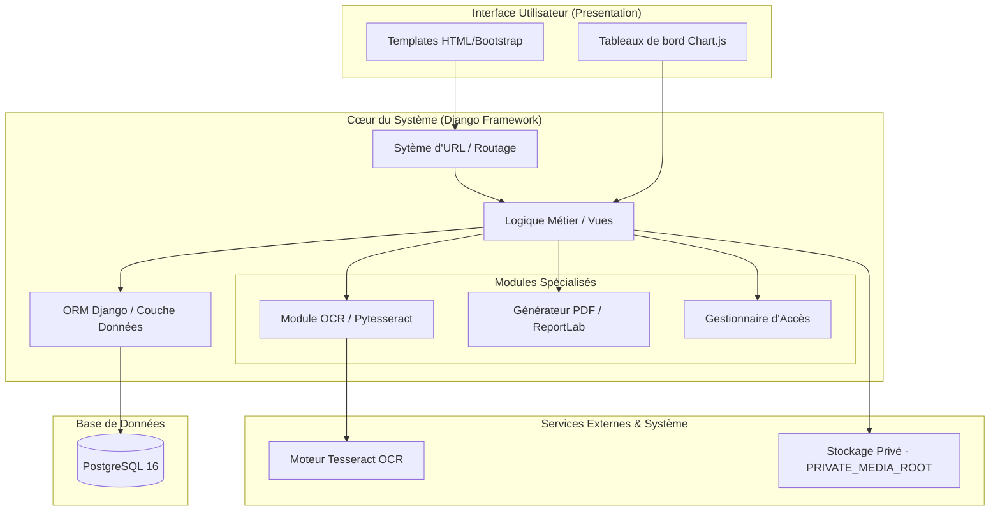
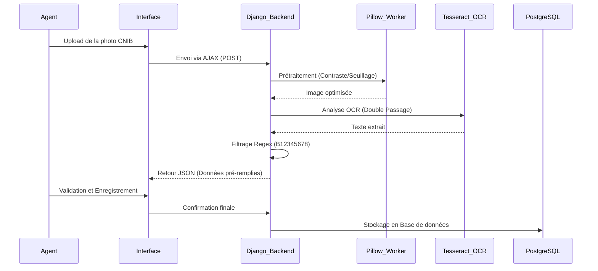

# Architecture Logicielle du Système de Gestion des Visiteurs (VMS – UWAZY)

## Introduction

Dans le cadre de notre projet intitulé **« Conception et réalisation d’un système de gestion des entrées et sorties des visiteurs avec scan de CNIB »**, nous avons conçu une architecture logicielle claire, robuste et sécurisée afin de garantir le bon fonctionnement de l’application.

L’architecture logicielle représente l’organisation interne du système. Elle définit comment les différents composants de l’application sont structurés, comment ils communiquent entre eux, et comment les données circulent depuis l’utilisateur jusqu’à la base de données.

Notre système étant destiné à gérer des informations sensibles comme les scans de CNIB, les identités des visiteurs, les historiques de visites et les rapports administratifs, il était essentiel de mettre en place une architecture fiable, maintenable et sécurisée.

Nous avons donc choisi une architecture adaptée aux besoins réels du projet, aux contraintes du stage, au budget nul et au déploiement local dans le réseau interne de l’organisation.

---

# 1. Vue d’ensemble de l’architecture

Notre système repose sur une architecture de type **application web monolithique modulaire**, développée avec le framework Django.

## 1.1 Définition d’une application web monolithique modulaire

Une application web monolithique signifie que toutes les fonctionnalités du système sont regroupées dans une seule application centrale. Cependant, le terme **modulaire** signifie que le code est organisé en "Apps Django" indépendantes (ex: `core`, `ocr`, `gestion_portes`), ce qui facilite la maintenance et l’évolution future.

Ce choix présente plusieurs avantages :
*   **Simplicité de déploiement :** Un seul serveur à gérer.
*   **Cohérence des données :** Partage facile des modèles entre les modules.
*   **Sécurité unifiée :** Un seul point de contrôle pour l'authentification et les permissions.
*   **Adaptation au LAN :** Performance optimale pour un réseau local interne.

## 1.2 Diagramme des Composants Logiciels

Le schéma suivant illustre l'organisation interne et les interactions entre les différents modules :

---

# 2. Modèle de conception utilisé : MVT

Notre système suit l’architecture **MVT (Model – View – Template)**, variante du modèle MVC, spécialement adaptée au framework Django pour séparer les responsabilités.

### 2.1 Model (Modèle)
Le modèle représente la structure des données et les relations. Par exemple, une **Visite** contient désormais une **Porte d'entrée** et une **Porte de sortie** distinctes, permettant de suivre précisément le trajet du visiteur dans l'établissement. Il définit les contraintes et l’intégrité des informations stockées en base de données.

### 2.2 View (Vue)
La vue agit comme le **cerveau du système**. Elle traite les demandes de l’utilisateur (scan CNIB, calcul de présence, génération de rapport), applique les règles métier et renvoie la réponse appropriée.

### 2.3 Template (Gabarit)
Le template représente l’interface visible par l’utilisateur. Il utilise HTML/CSS (Bootstrap) et JavaScript pour offrir une expérience moderne et fluide.

---

# 3. Architecture multicouche

### 3.1 Couche de Présentation
C'est la partie visible par les agents réceptionnistes et les administrateurs. Elle utilise **Bootstrap 5** pour le design responsive, **Chart.js** pour les statistiques visuelles et **jQuery/AJAX** pour une expérience sans rechargement de page, notamment lors du scan OCR.

### 3.2 Couche Application (Logique Métier)
Développée en **Python/Django**, cette couche contient les modules critiques :
*   **Module OCR :** Interaction avec `pytesseract` pour l'extraction de texte.
*   **Module Prétraitement (Pillow) :** Amélioration des images (niveaux de gris, contraste, seuillage) avant l'analyse.
*   **Module de Génération PDF :** Production des rapports administratifs via `xhtml2pdf` et `reportlab`.

### 3.3 Couche de Persistance
Elle gère le stockage permanent via **PostgreSQL 16**, choisi pour sa robustesse et sa capacité à gérer des relations de données complexes avec une grande intégrité.

---

# 4. Flux logiciel : Traitement du scan OCR

Le processus d'extraction des données suit un cycle rigoureux pour minimiser les erreurs.

---

# 5. Architecture de sécurité logicielle

### 5.1 Protection des scans CNIB
Les images sont stockées dans `PRIVATE_MEDIA_ROOT`. Elles sont inaccessibles par URL publique. Seuls les agents authentifiés peuvent les visualiser via une vue sécurisée qui valide les permissions en temps réel.

### 5.2 Validation et Protection CSRF
Toutes les saisies passent par les formulaires Django, protégeant contre les injections SQL et les failles XSS. Chaque interaction est sécurisée par un jeton **CSRF** contre les attaques de falsification de requêtes.

### 5.3 Gestion des rôles
Le système sépare strictement les droits :
*   **Agent de porte :** Responsable de l'enregistrement des entrées à sa porte et des sorties (même si le visiteur est entré par une autre porte). Accès restreint à la gestion opérationnelle.
*   **Administrateur :** Gestion globale (utilisateurs, portes, services), accès aux statistiques sensibles de l'ensemble de l'établissement et génération de rapports PDF consolidés.

---

# 6. Justification de la robustesse

La stabilité du système est garantie par l’utilisation de **transactions atomiques** via l'ORM Django. Chaque opération (ex: enregistrer une visite) est soit complétée à 100%, soit totalement annulée en cas d'erreur technique ou de coupure de courant, évitant ainsi toute incohérence dans la base PostgreSQL.

---

# 7. Documentation détaillée des modules

Pour une compréhension approfondie de chaque composant technique, des documents spécifiques détaillent le fonctionnement interne de chaque module :

*   **[Module OCR](file:///c:/Users/ousmanek/Desktop/STAGE/vms1/Detail_Module_OCR_VMS.md) :** Détail du pipeline de traitement d'image et de la reconnaissance de caractères.
*   **[Module Gestion des Flux](file:///c:/Users/ousmanek/Desktop/STAGE/vms1/Detail_Module_Flux_VMS.md) :** Logique de suivi des entrées/sorties et gestion multi-portes.
*   **[Module Sécurité & Traçabilité](file:///c:/Users/ousmanek/Desktop/STAGE/vms1/Detail_Module_Securite_VMS.md) :** Mécanismes d'audit, logs et protection des données sensibles.
*   **[Module Statistiques & Reporting](file:///c:/Users/ousmanek/Desktop/STAGE/vms1/Detail_Module_Stats_VMS.md) :** Fonctionnement du dashboard interactif et indicateurs de performance.
*   **[Module Génération PDF](file:///c:/Users/ousmanek/Desktop/STAGE/vms1/Detail_Module_PDF_VMS.md) :** Moteur d'édition de documents (Rapports, Journaux, Badges).
*   **[Module Administration](file:///c:/Users/ousmanek/Desktop/STAGE/vms1/Detail_Module_Admin_VMS.md) :** Gestion des utilisateurs, des services et configuration du système.
*   **[Module Stockage Sécurisé](file:///c:/Users/ousmanek/Desktop/STAGE/vms1/Detail_Module_Stockage_VMS.md) :** Gestion des fichiers privés et stratégie de stockage des documents d'identité.
*   **[Module Services & Destinations](file:///c:/Users/ousmanek/Desktop/STAGE/vms1/Detail_Module_Services_VMS.md) :** Cartographie de l'organisation interne et orientation des visiteurs.
*   **[Module Archivage & Conformité](file:///c:/Users/ousmanek/Desktop/STAGE/vms1/Detail_Module_Archivage_VMS.md) :** Stratégie de rétention des données et coffre-fort JSON.

---

# Conclusion
L’architecture logicielle du système VMS a été pensée pour allier sécurité, performance et coût nul. En combinant la puissance de l'Open Source (Django, PostgreSQL, Tesseract) avec une conception modulaire, nous avons construit une solution professionnelle et évolutive pour l’organisation UWAZY.
