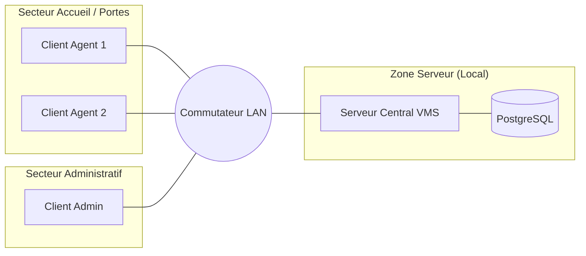

# Architecture Réseau : Système de Gestion des Visiteurs (VMS - UWAZY)

Ce document décrit l'infrastructure réseau nécessaire et mise en œuvre pour le déploiement local du système **VMS (Uwazy)** au sein d'une organisation.

---

## 1. Topologie du Réseau (Intranet)

Le système est conçu pour fonctionner dans un réseau local (LAN), garantissant que les données sensibles ne quittent jamais le périmètre physique de l'organisation.

### Diagramme de Topologie

---

## 2. Configuration du Serveur Local

Le serveur central héberge à la fois l'application Django et la base de données PostgreSQL.

*   **Adresse IP Statique :** Le serveur doit posséder une IP fixe (ex: `192.168.1.10`) pour permettre aux clients d'accéder à l'application sans interruption.
*   **Système d'Exploitation :** Windows ou Linux (Ubuntu recommandant pour la stabilité).
*   **Ports Ouverts :**
    *   `80` / `443` : Accès Web (HTTP/HTTPS via Nginx ou Waitress).
    *   `5432` : (Interne) Port par défaut de PostgreSQL (accès limité au serveur lui-même).

---

## 3. Adressage et Connectivité

| Équipement | Type d'IP | Rôle |
| :--- | :--- | :--- |
| **Serveur VMS** | Statique (ex: 10.0.0.50) | Hébergement de l'application et de l'OCR. |
| **Postes Agents** | DHCP | Accès à l'interface de saisie via navigateur. |
| **Passerelle (Router)** | Statique (ex: 10.0.0.1) | Gestion du trafic local. |

---

## 4. Sécurité Périmétrique et Logique

Pour respecter les contraintes de sécurité et de confidentialité du projet :

### 4.1 Isolation du Réseau
L'application n'est pas exposée sur Internet. L'accès est strictement réservé aux terminaux connectés physiquement ou via un VPN au réseau de l'organisation.

### 4.2 Firewall (Pare-feu)
*   **Incoming :** Seul le trafic HTTP/HTTPS est autorisé sur l'IP du serveur.
*   **Outgoing :** Le serveur n'a pas besoin d'accès Internet pour fonctionner (Tesseract fonctionne hors-ligne). Les mises à jour logicielles sont effectuées manuellement par l'administrateur système.

### 4.3 Accès HTTPS
Même en LAN, il est fortement recommandé d'installer un certificat SSL auto-signé pour chiffrer les données transitant entre les postes des agents et le serveur (protection contre le sniffing réseau).

---

## 5. Spécifications Matérielles Recommandées

| Composant | Recommandation Minimale |
| :--- | :--- |
| **Processeur** | Quad-Core (nécessaire pour la rapidité du traitement OCR) |
| **Mémoire (RAM)** | 8 Go (Django + Tesseract + PostgreSQL) |
| **Stockage** | SSD 256 Go (pour la rapidité des I/O et le stockage des scans CNIB) |

---
*Ce document garantit la pérennité et la sécurité de l'infrastructure réseau du projet VMS - Uwazy.*
