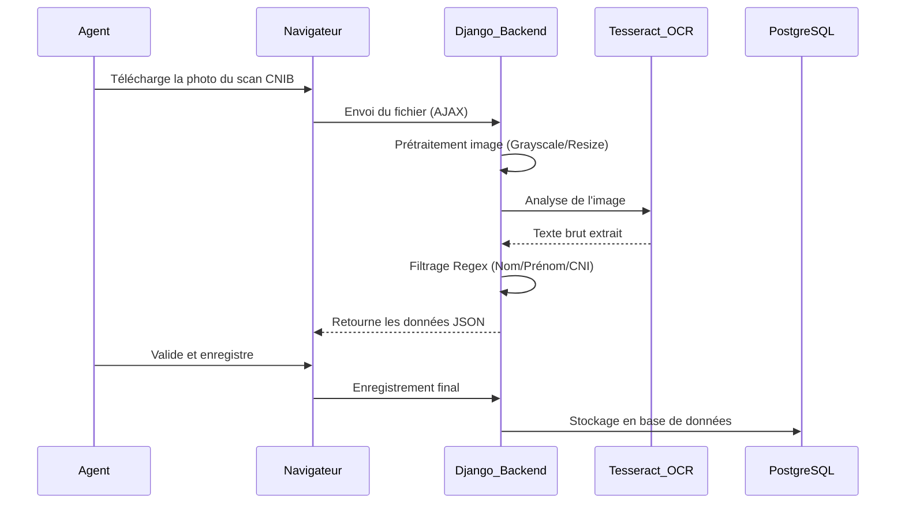
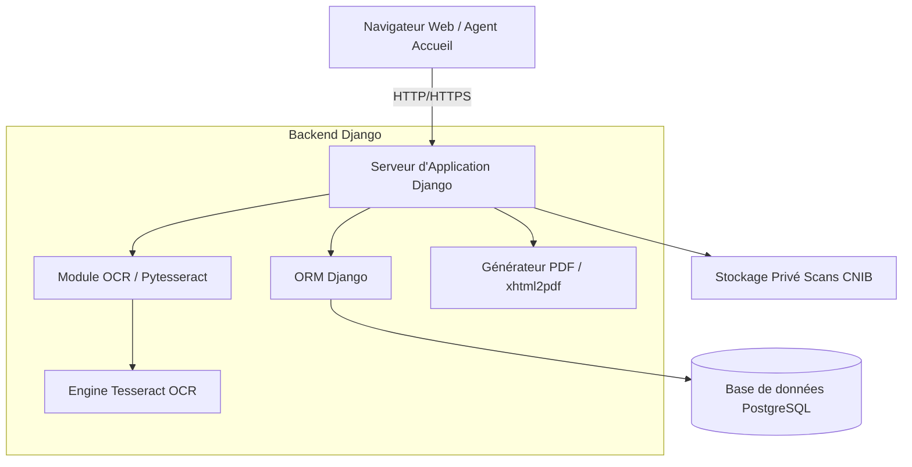

# Documentation Technique Complète : Système de Gestion des Visiteurs (VMS - UWAZY)

## 1. CONTEXTE ET OBJECTIF DU DOCUMENT

Le présent document constitue la documentation technique complète du projet de Système de Gestion des Visiteurs (VMS - Uwazy). Il a été conçu pour accompagner le mémoire final de stage et servir de guide de référence pour les développeurs, administrateurs système et décideurs techniques impliqués dans le projet.

Le niveau technique ciblé pour ce document est **intermédiaire**. Nous avons privilégié un langage clair et accessible (en utilisant le "nous" pour refléter le travail d'équipe et la démarche projet) afin de justifier de manière transparente l'intégralité des choix technologiques opérés.

---

## Chapitre 1 : Contexte et contraintes du projet

### 1.1 Présentation du projet
Le projet consiste à concevoir une application web robuste permettant de digitaliser et sécuriser l'accueil des visiteurs au sein d'une organisation (exemple : administration publique au Burkina Faso). L'objectif est de remplacer les registres papiers obsolètes par un système numérique capable de :
- Identifier les visiteurs par scan de CNIB via reconnaissance optique de caractères (OCR).
- Gérer précisément les flux : le système permet d'entrer par une porte A et de ressortir par une porte B, avec un suivi en temps réel de qui est "sur place".
- Générer des rapports statistiques et des journaux d'audit sécurisés.

### 1.2 Contraintes spécifiques et limites
Plusieurs contraintes majeures ont dicté nos choix techniques :
- **Budget Zéro :** Obligation d'utiliser exclusivement des technologies Open Source et gratuites, sans frais de licence.
- **Déploiement Local :** Le système doit pouvoir être hébergé sur des serveurs locaux (Intranet) pour garantir la souveraineté des données.
- **Maintenance :** Le code doit rester maintenable par une petite équipe technique locale.
- **Sécurité :** Les données d'identité (scans CNIB) sont sensibles et nécessitent une protection stricte contre les accès non autorisés.

---

## Chapitre 2 : Analyse comparative des technologies

Afin de garantir la performance et la pérennité du système, nous avons évalué plusieurs alternatives pour chaque composant majeur de la pile technologique.

### 2.1 Framework Backend
| Technologie | Avantages | Inconvénients considéré |
| :--- | :--- | :--- |
| **Django (Python)** | **Sécurité native intégrée, ORM puissant, rapidité de développement (Batteries included).** | Courbe d'apprentissage initiale. |
| Flask (Python) | Très léger, grande liberté. | Nécessite trop de bibliothèques tierces pour la sécurité et l'admin. |
| Laravel (PHP) | Très populaire, excellente documentation. | Nécessite souvent une stack PHP (LAMP) moins flexible pour l'OCR Python. |
| Express.js (Node) | Performance asynchrone élevée. | Moins rigide sur la structure de données complexe. |

### 2.2 Base de données
| Technologie | Pourquoi l'avoir analysée ? | Résultat de l'analyse |
| :--- | :--- | :--- |
| **PostgreSQL** | **Standard industriel pour la fiabilité et les relations complexes.** | **Choix retenu pour sa robustesse et son support natif JSON.** |
| MySQL / MariaDB | Très répandu au Burkina Faso. | Très bon, mais PostgreSQL offre une meilleure intégrité des données pour les audits. |
| MongoDB | Idéal pour les données non structurées. | Moins adapté car notre système est hautement relationnel. |

### 2.3 Reconnaissance Optique (OCR)
| Solution | Avantages | Obstacles |
| :--- | :--- | :--- |
| **Tesseract OCR** | **Gratuit, Open Source, fonctionne hors-ligne, supporte le français.** | **Choix retenu pour une indépendance totale (pas besoin d'Internet).** |
| Google Vision API | Précision exceptionnelle. | Payant et nécessite une connexion Internet permanente. |
| AWS Textract | Analyse de documents structurés. | Coût élevé et dépendance au Cloud. |

---

## Chapitre 3 : Justification des choix techniques

Nous détaillons ici les raisons ayant motivé le choix définitif de notre stack technologique.

### 3.1 Backend : Django 6.0.3 et Python 3.12
Nous avons choisi **Django** comme framework principal pour trois raisons critiques :
1. **La Sécurité :** Django protège nativement contre les injections SQL, les attaques CSRF (Cross-Site Request Forgery) et le cross-site scripting (XSS).
2. **L'Administration :** L'interface d'administration automatique nous a permis de gérer facilement les **Portes** (points d'accès), les **Services** (bureaux de destination) et les **Logs** (historique de qui a fait quoi).
3. **La Gestion des Flux :** Le système traite désormais l'Entrée et la Sortie comme deux événements distincts liés à des portes différentes, offrant une flexibilité totale pour les grands bâtiments.

### 3.2 Base de Données : PostgreSQL 16
Bien que MySQL soit très commun, nous avons privilégié **PostgreSQL** pour sa capacité à gérer de gros volumes de logs d'audit sans perte de performance. L'utilisation de l'**ORM Django** garantit que notre code reste agnostique (nous n'écrivons pas de SQL brut), ce qui facilite une future migration ou évolution.

### 3.3 Interface Utilisateur : Bootstrap 5.3 et Chart.js
Pour le frontend, nous avons opté pour une approche "Premium mais Légère" :
- **Bootstrap 5.3 :** Nous l'utilisons pour garantir une interface responsive (utilisable sur PC et mobile) avec un design moderne (Inter Font).
- **Chart.js 4.4 :** Cette bibliothèque nous permet de transformer les données brutes de visites en graphiques dynamiques et interactifs sur le tableau de bord (flux journaliers, répartition par service).
- **jQuery 3.7 :** Utilisé pour la fluidité des appels AJAX lors du scan OCR.

### 3.4 OCR : Tesseract et Preprocessing Pillow
Le défi majeur était la lecture des cartes d'identité burkinabè. Pour optimiser Tesseract, nous avons implémenté un système de **double passage** (double pass) :
1. **Passe 1 :** Lecture normale pour extraire le Nom et le Prénom.
2. **Passe 2 :** Prétraitement de l'image (conversion en niveaux de gris, redimensionnement x2 et seuillage) via **Pillow** pour isoler spécifiquement le numéro CNI (format B suivi de 8 chiffres).

---

## Chapitre 4 : Architecture retenue

### 4.1 Architecture Logicielle (MVT)
Le projet suit strictement l'architecture **Model-View-Template (MVT)** de Django :
- **Models :** Structure des données (Visiteurs, Visites, Portes) gérée par l'ORM.
- **Views :** Logique métier (traitement OCR, calcul du temps de présence).
- **Templates :** Interfaces utilisateurs en HTML5/CSS3.

### 4.2 Flux de données (Enregistrement d'un visiteur)

### 4.3 Architecture Technique Globale

### 4.4 Sécurité des Documents
Nous avons mis en place un **stockage privé** (`PRIVATE_MEDIA_ROOT`). Contrairement aux fichiers statiques classiques, les scans des cartes d'identité ne sont pas accessibles via une URL publique. Seuls les administrateurs connectés peuvent les consulter via une vue Django sécurisée qui vérifie les permissions avant de servir le fichier.

---

## Conclusion

Le choix de cette stack technologique (Python/Django/PostgreSQL/Tesseract) répond parfaitement aux exigences de souveraineté, de coût et de sécurité du projet Uwazy. En combinant la puissance de l'Open Source avec une architecture robuste, nous avons créé un outil performant, évolutif et parfaitement adapté au contexte institutionnel burkinabè. Cette documentation technique valide la solidité de notre démarche et la pertinence de nos choix pour les années à venir.
