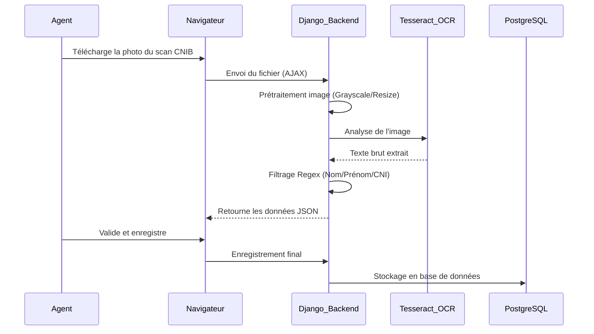

# Documentation Technique Complète : Système de Gestion des Visiteurs (VMS - UWAZY)

## 1. CONTEXTE ET OBJECTIF DU DOCUMENT

Le présent document constitue la documentation technique complète du projet de Système de Gestion des Visiteurs (VMS - Uwazy). Il a été conçu pour accompagner le mémoire final de stage et servir de guide de référence pour les développeurs, administrateurs système et décideurs techniques impliqués dans le projet.

Le niveau technique ciblé pour ce document est **intermédiaire**. Nous avons privilégié un langage clair et accessible afin de justifier de manière transparente l'intégralité des choix technologiques opérés.

---

## Chapitre 1 : Contexte et contraintes du projet

### 1.1 Présentation du projet
Le projet consiste à concevoir une application web robuste permettant de digitaliser et sécuriser l'accueil des visiteurs au sein d'une organisation. L'objectif est de remplacer les registres papiers obsolètes par un système numérique capable de :
- Identifier les visiteurs par scan de CNIB via reconnaissance optique de caractères (OCR).
- Gérer précisément les flux : entrée par une porte A et sortie par une porte B, avec un suivi en temps réel.
- **Intelligence Métier :** Fournir des statistiques descriptives avancées (Top Visiteurs, Taux de fréquentation par service).
- **Sécurité :** Garantir la traçabilité des actions et la sécurité des sessions utilisateur.

### 1.2 Contraintes spécifiques et limites
- **Budget Zéro :** Technologies Open Source exclusivement.
- **Déploiement Local :** Hébergement Intranet pour la souveraineté des données.
- **Maintenance :** Code modulaire et documenté.
- **UX Premium :** Interface moderne, responsive et intuitive (Grid layouts, Modals).

---

## Chapitre 2 : Analyse comparative des technologies

### 2.1 Framework Backend (Django 6.0.3)
Choisi pour sa sécurité native (CSRF, XSS, SQLi), son ORM puissant et son interface d'administration personnalisable qui permet de gérer les **Agents**, **Portes** et **Services** avec une grande efficacité.

### 2.2 Base de données (PostgreSQL)
Standard industriel retenu pour sa robustesse, sa gestion des audits massifs et sa fiabilité transactionnelle.

### 2.3 Reconnaissance Optique (OCR)
**Tesseract OCR** couplé à **Pillow** (prétraitement) permet une extraction hors-ligne précise des données CNIB (Nom, Prénom, CNI).

---

## Chapitre 3 : Justification des choix UI/UX

### 3.1 Design System : Bootstrap 5.3 & Vanilla CSS
Nous avons opté pour une esthétique premium :
- **Dashboard Dynamique :** Utilisation de cartes statistiques et de graphiques **Chart.js** pour une lecture instantanée des KPIs.
- **Composants Interactifs :** Utilisation de **Modals Bootstrap** pour l'ajout de services et la confirmation de déconnexion, améliorant la fluidité (pas de rechargement inutile).
- **Responsive Grid :** Affichage des services sous forme de cartes colorées dynamiquement pour une meilleure UX.

### 3.2 Visualisation de Données
- **Analytique Services :** Calcul en temps réel de la part de marché de chaque service dans le flux total.
- **Tracking Temporel :** Graphiques d'évolution hebdomadaire pour identifier les pics de charge.

---

## Chapitre 4 : Architecture logicielle et sécurité

### 4.1 Sécurité des Accès
- **RBAC Strict :** Séparation des rôles Administrateur / Agent.
- **Affectation de Poste :** Obligation pour un agent d'être affecté à une porte physique pour opérer.
- **Sécurité de Session :** Confirmation de déconnexion via modal pour éviter les pertes de session involontaires.

### 4.2 Flux de données OCR

```mermaid
sequenceDiagram
    participant Agent
    participant Navigateur
    participant Django_Backend
    participant Tesseract_OCR
    participant PostgreSQL

    Agent->>Navigateur: Télécharge la photo du scan CNIB
    Navigateur->>Django_Backend: Envoi du fichier (AJAX)
    Django_Backend->>Django_Backend: Prétraitement image (Grayscale/Resize)
    Django_Backend->>Tesseract_OCR: Analyse de l'image
    Tesseract_OCR-->>Django_Backend: Texte brut extrait
    Django_Backend->>Django_Backend: Filtrage Regex (Nom/Prénom/CNI)
    Django_Backend-->>Navigateur: Retourne les données JSON
    Agent->>Navigateur: Valide et enregistre
    Navigateur->>Django_Backend: Enregistrement final
    Django_Backend->>PostgreSQL: Stockage en base de données
```

---

## Conclusion

Le système VMS - Uwazy n'est pas qu'un simple registre numérique ; c'est un outil d'intelligence organisationnelle. En combinant la robustesse de Django avec une interface moderne et des outils analytiques précis, nous offrons une solution complète et pérenne pour la gestion sécurisée des flux de visiteurs.
