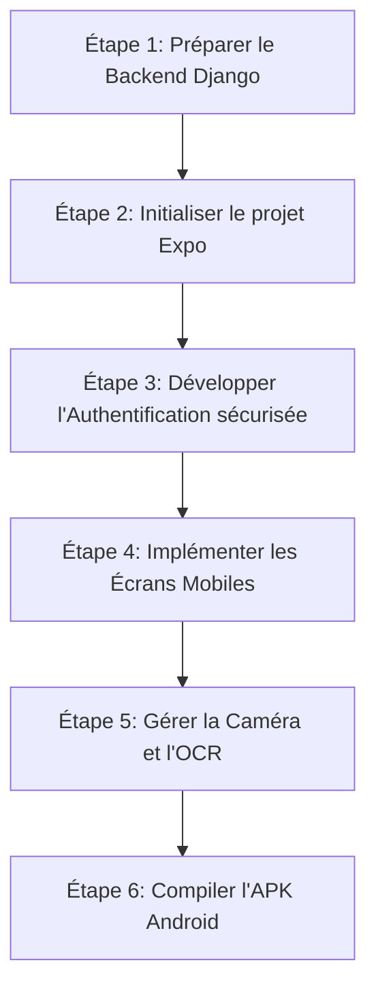

# 📱 Guide d'Architecture et de Développement Mobile : Version Android avec React Native & Expo

Ce guide détaille la feuille de route technique, les outils et les étapes nécessaires pour concevoir et déployer une application mobile Android pour le projet **UWaZy VMS**, en réutilisant le même backend Django sans perturber le fonctionnement de l'application web existante.

---

## 🏗️ Choix de l'Architecture de Communication

Le backend actuel de **UWaZy VMS** est un monolithe Django traditionnel qui renvoie du HTML généré côté serveur (via des templates Django) et utilise une authentification basée sur les sessions/cookies (`SessionMiddleware`).

Pour connecter une application mobile React Native (Expo), deux approches architecturales sont possibles :

### Option 1 : L'approche Native (Recommandée pour une expérience optimale)
L'application mobile React Native consomme une **API REST (JSON)** exposée par Django. 
* **Impact sur le projet existant :** Aucun changement sur le code actuel. On ajoute simplement une nouvelle application Django (ex: `api/`) dans le projet, ou on déclare des endpoints spécifiques dans `core/views.py` sans modifier les vues web actuelles.
* **Avantages :** Expérience utilisateur fluide (60 FPS), utilisation optimisée de la caméra pour l'OCR, stockage sécurisé local, et interface utilisateur moderne.

### Option 2 : L'approche Hybride (WebView - Zéro modification backend)
L'application mobile charge l'interface web responsive actuelle dans un composant `WebView` de React Native.
* **Impact sur le projet existant :** Strictement aucun.
* **Avantages :** Développement instantané (moins d'une journée de travail).
* **Inconvénients :** Moins fluide, dépendance totale au réseau, et complexité pour interfacer les fonctionnalités matérielles (comme la caméra pour l'OCR).

*Ce guide se concentre sur l'**Option 1 (App native)**, qui représente la bonne pratique pour un projet professionnel.*

---

## 🛠️ Boîte à Outils et Technologies Requises

### 1. Environnement de Développement Mobile
* **Node.js (LTS)** : Requis pour faire tourner le serveur de développement React Native / Metro bundler.
* **Expo CLI & Expo Go** : Permet de développer rapidement, de tester l'application en temps réel sur un smartphone physique (via un code QR) sans avoir besoin de configurer Android Studio immédiatement.
* **Android Studio & SDK Android** : Requis pour compiler l'application finale en fichier `.apk` localement, ou pour utiliser un émulateur Android.
* **Java Development Kit (JDK 17)** : Requis pour la compilation Android.

### 2. Outils de Build et Déploiement
* **EAS (Expo Application Services) CLI** : Outil cloud d'Expo pour compiler des fichiers APK (`eas build --platform android`) sans avoir besoin d'une machine ultra-puissante localement.

---

## 📋 Plan d'Action Étape par Étape



### Étape 1 : Préparer le Backend Django (sans casser l'existant)
Pour communiquer avec l'application mobile, le backend doit exposer des points d'accès (endpoints) qui renvoient du format **JSON**.

1. **Installer un framework d'API (au choix)** :
   * **Django REST Framework (DRF)** (Très complet, standard de l'industrie)
   * **Django Ninja** (Moderne, rapide, basé sur Pydantic et type hints python, très adapté pour Expo)
2. **Créer une application `api` dédiée** :
   ```bash
   python manage.py startapp api
   ```
   *En déclarant les routes d'API dans `api/urls.py` et en l'incluant dans `gestions_entree_sortie/urls.py` via `path('api/', include('api.urls'))`, vous isolez totalement la partie mobile de l'application web actuelle.*
3. **Mettre en place l'authentification par Token / JWT** :
   * Les mobiles ne gèrent pas bien les sessions par cookies. Utilisez **django-rest-framework-simplejwt** pour une authentification par jetons (AccessToken + RefreshToken).
4. **Créer les endpoints nécessaires** :
   * `/api/login/` (Validation des identifiants et retour de jeton JWT + configuration 2FA).
   * `/api/login/2fa/` (Vérification du code OTP de double facteur).
   * `/api/visiteurs/` (Liste, recherche par numéro CNIB, création de visiteur avec envoi d'images).
   * `/api/visites/` (Enregistrement d'une entrée et d'une sortie).
   * `/api/ocr/scan/` (Réception de la photo recadrée et retour des textes extraits par Tesseract).

---

### Étape 2 : Initialiser le projet React Native & Expo
1. Créez un nouveau projet Expo en utilisant TypeScript :
   ```bash
   npx create-expo-app vms-mobile --template expo-template-blank-typescript
   ```
2. Installez les dépendances indispensables :
   ```bash
   cd vms-mobile
   # Navigation entre les écrans
   npx expo install expo-router react-native-safe-area-context react-native-screens
   
   # Requêtes HTTP et gestion d'état globale
   npm install axios @tanstack/react-query
   
   # Stockage sécurisé des tokens JWT
   npx expo install expo-secure-store
   
   # Accès à la caméra et gestion des fichiers (pour les scans CNIB)
   npx expo install expo-camera expo-image-picker expo-file-system expo-sharing
   ```

---

### Étape 3 : Gérer l'Authentification et le 2FA sur Mobile
1. **Formulaire de Connexion** : Un écran demandant l'identifiant et le mot de passe.
2. **Écran de Double Facteur (2FA)** : Si le serveur Django répond que le compte requiert le 2FA, l'application mobile affiche un second écran pour saisir le code OTP à 6 chiffres.
3. **Stockage sécurisé** : Une fois authentifié, enregistrez le jeton JWT dans le trousseau sécurisé du téléphone :
   ```typescript
   import * as SecureStore from 'expo-secure-store';
   await SecureStore.setItemAsync('userToken', token);
   ```
4. **Intercepteurs d'API** : Configurez Axios pour ajouter automatiquement le Token JWT dans les en-têtes de chaque requête HTTP :
   ```typescript
   axios.interceptors.request.use(async (config) => {
     const token = await SecureStore.getItemAsync('userToken');
     if (token) {
       config.headers.Authorization = `Bearer ${token}`;
     }
     return config;
   });
   ```

---

### Étape 4 : Adapter l'OCR et la Caméra sur Mobile
C'est le point central de **UWaZy VMS** (Scan CNIB).
1. **Interface de capture** : Utilisez le composant `CameraView` d'**expo-camera**.
2. **Guide visuel (Cadrage)** : Dessinez une boîte de guidage superposée en CSS (Absolute positioning) sur l'écran pour indiquer à l'utilisateur où placer la carte d'identité.
3. **Rognage de l'image (Cropping)** : 
   * Prenez la photo en haute résolution.
   * Utilisez une bibliothèque comme **react-native-image-manipulator** pour rogner l'image selon les dimensions de la boîte de guidage (pour supprimer le bruit visuel comme sur la version web).
4. **Envoi au backend** : Envoyez l'image rognée en `FormData` à l'endpoint `/api/ocr/scan/`. Le backend Django exécutera Tesseract localement et renverra le JSON contenant les données lues (Nom, Prénom, CNIB, etc.).

---

### Étape 5 : Téléchargement et Visualisation des PDF
Actuellement, l'application web génère des fiches de visite et des rapports d'audit en PDF via `xhtml2pdf`.
* **Sur le mobile** : L'utilisateur clique sur "Télécharger la fiche".
* **Technique** :
  1. Utilisez `expo-file-system` pour télécharger le fichier PDF depuis l'URL Django `/api/visiteurs/<id>/fiche-pdf/`.
  2. Utilisez `expo-sharing` pour ouvrir le menu de partage Android (permettant d'imprimer le PDF, de l'envoyer sur WhatsApp ou de l'ouvrir dans un lecteur PDF).
  ```typescript
  import * as FileSystem from 'expo-file-system';
  import * as Sharing from 'expo-sharing';

  const downloadAndShare = async (url, filename) => {
    const result = await FileSystem.downloadAsync(url, FileSystem.documentDirectory + filename);
    await Sharing.shareAsync(result.uri);
  };
  ```

---

## 🚀 Génération de l'APK (Fichier Android final)

Une fois l'application développée et testée avec l'application **Expo Go** sur votre téléphone, vous pouvez compiler l'application.

1. Installez l'outil de build EAS globalement :
   ```bash
   npm install -g eas-cli
   ```
2. Connectez-vous à votre compte Expo :
   ```bash
   eas login
   ```
3. Configurez le projet pour les builds :
   ```bash
   eas build:configure
   ```
4. Lancez la création de l'APK de test (sans passer par Google Play Store) :
   ```bash
   eas build --platform android --profile preview
   ```
   *EAS compilera l'application sur ses serveurs cloud et vous fournira un lien de téléchargement direct ou un Code QR pour installer le fichier `.apk` directement sur n'importe quel smartphone Android.*
